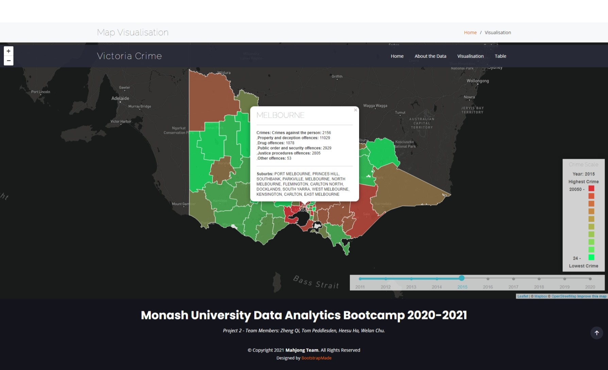

# Project-2 Living in Victoria, Living Safe

## Background
We created an interactive visualisation of crime in each area of Victoria to assist in deciding the safest areas to live in. 
* Victoria has some of the fastest growing Local Government Area (LGA) populations in Australia.
* More than 4 Million people call Victoria home.
* Victorias population grows around 20,000 to 150,000 people each year.

Each area of Victoria is split into Local Government Areas (LGAs) where a cloropleth map is created. The crime amount for each LGA is shown in a diferent colour determined bythe crime colour scale where higher crime LGAs can be easily visualised. By also clicking on the LGA area, all suburbs and types of crimes are also shown in a popup. A time slider plugin for leaflet was added to the visualisation to show all the crimes from each year from 2010-2020.

We strongly believe this app will assist people moving or living in Victoria to find a safe place to live.

## Status
* Project is finalised
* Published site: https://vic-crime.herokuapp.com/

## Project team
* Zheng Qi: http://github.com/qizhengyaoyao 
* Heesu Ha https://github.com/Heesu-H
* Tom Peddlesden https://github.com/tomjp90
* Welan Chu https://github.com/welanc

## Technologies

* Python
* Pymongo
* Flask
* Javascript
  * -D3
  * -Leaflet
* HTML
* CSS
* Heroku - publish site

## Data

### Data source
* [Victorian Crime Data](https://discover.data.vic.gov.au/dataset/crime-by-location-data-table)
* [Suburb locality boundary](https://data.gov.au/dataset/ds-dga-af33dd8c-0534-4e18-9245-fc64440f742e/details)
* [Victorian Local Government Area Boundaries](https://data.gov.au/dataset/ds-dga-bdf92691-c6fe-42b9-a0e2-a4cd716fa811/details)

### Data size and store
* The total document ammount of our data is 28295.
* The whole data is save in mongodb atlas cluster.

## Deploy enviorment

This app is deployed on heroku.

## Backend

The backend has 4 routes for rendering the html pages and 7 routes for API functions to return the required data.
The key for mongodb server and api are stored on heroku and retrieved by flask file.

### API functions
* Route /api/v3.0/all: return all the crime data for each suburb/year.
* Route /api/v3.0/lga/all: return all  the crime for each local government area/year.
* Route /api/v3.0/region/all: return all  the crime for each region/year.
* Route /api/v3.0/vic/all: return all  the crime for each year in victoria.
* Route /api/v3.0/lga/all_suburb: return the suburb list of each local government area.
* Route /api/v3.0/all_type: return the crime division/subdivision name and code.
* Route /api/v3.0/crime_data: return the filtered data depending on the input parameters. For example, request https://vic-crime.herokuapp.com/api/v3.0/crime_data?suburb=melbourne&year=2011&year=2020&off_field=subdiv will retrun the crime data (exclude the data of crime subdivisions) of melbourne suburb in year 2011 and year 2020.

## Web frontend

The vic-crime website has 4 pages, including the home page, data source page, visulisation page and table page

### Geomap visualisation
* Time slider: The geomap has a time slider plugin as shown in the right bottom of the [visualisation page](https://vic-crime.herokuapp.com/visualisation). Clicking on them can show the crime distribution in victoria in different years.
* Popup: Cliding on differnt LGA will show the details of the crime data and the suburb infomation.
* Choropleth: choropleth map is used to show the crime data of different areas. Legend is shown in the right bottom of the page. Red areas have more crime cases, while green areas have less.

### Table page
The table page can show the detailed crime data of suburbs you want to investigate. For example, enter 3166 in postcode box and 2011 in year box and click on "Filter Table" button, the data for suburbs hughesdale/huntingdale/oakleigh/oakleigh east in 2011 will pop up. The table of codes and their corresponding name is also given at the bottom right.

## File structure

* Folder "data": this folder contains the jupyter notebook for data wrangling and the source of dataset we used in this project.
* Folder "static": this folder contains the javascript files, css files and othe relevant format files.
* Folder "templates": this folder contains all the html files.
* File app.py: this file is the backend flask file.
* File requirements.txt: this file is the environment file.

## Notes 

Please feel free to contact us!
